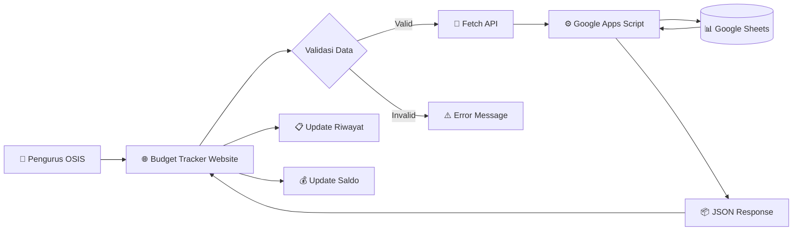
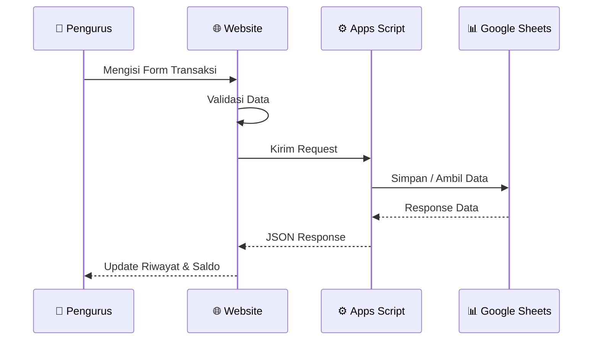

<div align="center">


# 💰 Budget Tracker OSIS

### Sistem Pencatatan & Monitoring Keuangan OSIS

**Periode Kepengurusan 2026/2027**

<br>

[](https://developer.mozilla.org/en-US/docs/Web/HTML)
[](https://developer.mozilla.org/en-US/docs/Web/CSS)
[](https://developer.mozilla.org/en-US/docs/Web/JavaScript)
[](https://script.google.com/)
[](https://www.google.com/sheets/about/)
[](https://pages.github.com/)

<br>

[]()
[]()
[]()

<br>

<a href="#-fitur-utama">✨ Features</a> • <a href="#-cara-menggunakan">📖 Usage</a> • <a href="#-menjalankan-secara-lokal">💻 Local Setup</a> • <a href="#-konfigurasi-backend">🔌 API</a> • <a href="#-deployment">🚀 Deployment</a>

</div>

---

## 🌐 Live Demo

> 🚀 **Website:** `MASUKKAN_URL_GITHUB_PAGES_DI_SINI`

<div align="center">

[](MASUKKAN_URL_GITHUB_PAGES)

</div>

---

# 📖 About The Project

**Budget Tracker OSIS** adalah aplikasi berbasis web yang dirancang untuk membantu pengurus **OSIS SMA Al-Fityan School Tangerang** dalam mencatat dan memantau kondisi keuangan organisasi.

Aplikasi ini digunakan untuk mencatat seluruh transaksi **pemasukan dan pengeluaran** selama periode kepengurusan **2026/2027**.

Berbeda dengan pencatatan manual menggunakan spreadsheet, sistem ini menyediakan antarmuka berbasis web sehingga pengurus dapat melakukan pencatatan transaksi dengan lebih mudah, terstruktur, dan terpusat.

Data yang dimasukkan melalui website akan diteruskan ke **Google Apps Script** dan disimpan secara otomatis di **Google Sheets**.

```text
Website
   ↓
Google Apps Script API
   ↓
Google Sheets Database
```

Dengan sistem ini, Google Sheets tetap digunakan sebagai pusat penyimpanan data tanpa mengharuskan pengurus untuk mengedit spreadsheet secara langsung.

---

# 🎯 Project Goals

Project ini dibuat untuk:

* 📌 Mencatat pemasukan dan pengeluaran secara terstruktur.
* 📚 Menyimpan riwayat keuangan selama masa kepengurusan.
* 🔎 Mempermudah pencarian dan penelusuran transaksi.
* 💰 Menghitung saldo secara otomatis.
* 📊 Memantau total pemasukan dan pengeluaran.
* 🛡️ Mengurangi risiko data hilang atau tercatat ganda.
* 🤝 Mendukung transparansi keuangan organisasi.
* ⚡ Mempercepat proses pencatatan transaksi.

---

# ✨ Fitur Utama

| Fitur                 | Deskripsi                                   |
| --------------------- | ------------------------------------------- |
| ➕ Tambah Transaksi    | Menambahkan pemasukan atau pengeluaran      |
| 📅 Filter Bulan       | Menampilkan transaksi berdasarkan bulan     |
| 💰 Format Rupiah      | Nominal diformat secara otomatis            |
| 📊 Statistik Keuangan | Total pemasukan, pengeluaran, dan saldo     |
| 📋 Riwayat Transaksi  | Menampilkan seluruh transaksi yang tercatat |
| 🗑️ Hapus Transaksi   | Menghapus transaksi yang tidak diperlukan   |
| ☁️ Cloud Database     | Data disimpan di Google Sheets              |
| 📱 Responsive Design  | Mendukung desktop dan mobile                |
| ⚡ Real-Time Update    | Riwayat diperbarui setelah transaksi        |

---

# 🧰 Tech Stack

<div align="center">

| Frontend   | Backend            | Database          | Deployment     |
| ---------- | ------------------ | ----------------- | -------------- |
| HTML       | Google Apps Script | Google Sheets     | GitHub Pages   |
| CSS        | JavaScript API     | Cloud Spreadsheet | GitHub Actions |
| JavaScript | Web App            | Google Cloud      | CI/CD          |

</div>

<br>

### Frontend

```text
HTML5
CSS3
JavaScript
```

### Backend

```text
Google Apps Script
REST-like API
JSON Response
```

### Database

```text
Google Sheets
```

### Deployment

```text
GitHub
GitHub Actions
GitHub Pages
```

---

# 🏗️ System Architecture



---

# 🔄 Application Flow



---

# 📂 Project Structure

```text
.
├── index.html
├── style.css
├── script.js
│
├── assets/
│   └── logo_OSIS_SMAFISTA.png
│
├── config.example.js
├── config.js
├── .gitignore
│
├── .github/
│   └── workflows/
│       └── deploy-pages.yml
│
└── README.md
```

### File Description

| File                | Description                           |
| ------------------- | ------------------------------------- |
| `index.html`        | Struktur utama website                |
| `style.css`         | Styling dan responsive layout         |
| `script.js`         | Logika aplikasi dan API communication |
| `assets/`           | Logo dan aset visual                  |
| `config.example.js` | Template konfigurasi API              |
| `config.js`         | Konfigurasi lokal                     |
| `.gitignore`        | File yang tidak di-track Git          |
| `deploy-pages.yml`  | Workflow GitHub Pages                 |
| `README.md`         | Dokumentasi project                   |

---

# 🚀 Quick Start

## 1️⃣ Clone Repository

```bash
git clone https://github.com/USERNAME/NAMA-REPOSITORY.git
```

Masuk ke folder project:

```bash
cd NAMA-REPOSITORY
```

---

## 2️⃣ Setup Configuration

Salin file:

```text
config.example.js
```

Menjadi:

```text
config.js
```

Kemudian isi URL Google Apps Script:

```js
window.APP_CONFIG = {
    API_URL: "URL_GOOGLE_APPS_SCRIPT_MILIKMU"
};
```

> ⚠️ Jangan mengunggah `config.js` ke repository public.

---

## 3️⃣ Run Locally

Gunakan local server seperti:

* VS Code Live Server
* Python HTTP Server
* Local Web Server lainnya

Contoh menggunakan Python:

```bash
python -m http.server 8000
```

Kemudian buka:

```text
http://localhost:8000
```

---

# 📖 Cara Menggunakan

## ➕ Menambahkan Transaksi

1. Buka website.

2. Pilih bulan transaksi.

3. Masukkan nama transaksi.

4. Pilih tanggal.

5. Pilih jenis transaksi:

   * 🟢 Pemasukan
   * 🔴 Pengeluaran

6. Masukkan nominal.

7. Masukkan nama penginput.

8. Tambahkan keterangan jika diperlukan.

9. Klik **Simpan Transaksi**.

Data akan dikirim ke Google Apps Script dan disimpan ke Google Sheets.

---

## 📊 Melihat Riwayat

1. Pilih bulan.
2. Website mengambil data dari backend.
3. Riwayat transaksi ditampilkan.
4. Sistem menghitung:

```text
Total Pemasukan
        ↓
Total Pengeluaran
        ↓
Saldo Akhir
```

---

## 🗑️ Menghapus Transaksi

1. Cari transaksi pada tabel.
2. Klik tombol **Hapus**.
3. Konfirmasi penghapusan.
4. Backend menghapus data dari Google Sheets.
5. Riwayat diperbarui.

---

# 🔌 API Documentation

Backend menggunakan **Google Apps Script Web App**.

## 📅 Get Available Months

```http
GET ?action=months
```

---

## 📋 Get Transaction History

```http
GET ?action=riwayat&bulan=JANUARI
```

---

## ➕ Add Transaction

```http
POST
```

Contoh payload:

```json
{
    "action": "tambah",
    "bulan": "JANUARI",
    "nama": "Pembelian Perlengkapan",
    "tanggal": "2026-09-05",
    "jenis": "Pengeluaran",
    "nominal": 150000,
    "penginput": "Nama Pengurus",
    "keterangan": "Pembelian perlengkapan kegiatan"
}
```

---

## 🗑️ Delete Transaction

```http
POST
```

Contoh payload:

```json
{
    "action": "hapus",
    "id": "TRANSACTION_ID"
}
```

---

# 🔐 Configuration & Security

Project menggunakan file konfigurasi:

```text
config.js
```

File tersebut dimasukkan ke `.gitignore`:

```gitignore
config.js
```

Template konfigurasi tersedia melalui:

```text
config.example.js
```

---

## GitHub Secret

Saat deployment, URL API dapat disimpan sebagai Repository Secret:

```text
Name: API_URL
Value: URL Google Apps Script
```

Workflow GitHub Actions dapat membuat `config.js` secara otomatis menggunakan secret tersebut.

> ⚠️ **Important:** URL API yang digunakan oleh frontend pada akhirnya tetap dapat terlihat melalui browser karena website harus mengakses endpoint tersebut.

Karena itu, jangan menganggap URL API sebagai sistem keamanan utama.

Keamanan data sebaiknya diterapkan melalui:

* Pengaturan akses Google Sheets.
* Validasi request pada Google Apps Script.
* Pembatasan akses backend.
* Validasi data input.
* Audit terhadap transaksi yang dilakukan.

---

# 🚀 Deployment

Project menggunakan:

```text
GitHub Repository
        ↓
GitHub Actions
        ↓
Generate config.js
        ↓
GitHub Pages
```

## Setup

### 1. Push Project

Push seluruh project ke GitHub.

---

### 2. Add Repository Secret

Buka:

```text
Settings
→ Secrets and variables
→ Actions
```

Tambahkan:

```text
API_URL
```

Isi dengan URL deployment Google Apps Script.

---

### 3. Enable GitHub Pages

Buka:

```text
Settings
→ Pages
```

Pilih:

```text
Source: GitHub Actions
```

---

### 4. Deploy

Push ke branch:

```text
main
```

GitHub Actions akan menjalankan workflow deployment secara otomatis.

## Deployment ke Cloudflare Pages

Cloudflare Pages tidak menjalankan workflow GitHub Actions. Gunakan build script bawaan project agar `config.js` dibuat saat proses build.

### Pengaturan Build

Pada Cloudflare Pages, pilih **Connect to Git** lalu atur:

```text
Framework preset: None
Build command: npm run build
Build output directory: dist
```

### Menambahkan API URL

Di project Cloudflare Pages, buka **Settings** > **Environment variables**. Tambahkan variable untuk environment **Production** dan **Preview**:

```text
Name: API_URL
Value: URL deployment Google Apps Script
```

Setelah disimpan, lakukan redeploy. File `build.mjs` akan menyalin website ke folder `dist` dan membuat `dist/config.js` dari variable `API_URL`, sehingga koneksi ke Google Apps Script tetap berjalan.

Alur deployment Cloudflare:

```text
GitHub Repository
        ↓
Cloudflare Pages Build
        ↓
npm run build
        ↓
Generate dist/config.js
        ↓
Cloudflare Pages
```

---

# 🧪 Testing Checklist

* [x] Menambahkan transaksi pemasukan.
* [x] Menambahkan transaksi pengeluaran.
* [x] Validasi input.
* [x] Format nominal Rupiah.
* [x] Perhitungan total pemasukan.
* [x] Perhitungan total pengeluaran.
* [x] Perhitungan saldo.
* [x] Filter transaksi berdasarkan bulan.
* [x] Penghapusan transaksi.
* [x] Tampilan desktop.
* [x] Tampilan mobile.

---

# 🗺️ Roadmap

Beberapa fitur yang direncanakan untuk pengembangan selanjutnya:

* [ ] 🔐 Sistem login.
* [ ] 👥 Role-based access.
* [ ] 📊 Dashboard statistik.
* [ ] 📈 Grafik keuangan.
* [ ] 📁 Export Excel.
* [ ] 📄 Export PDF.
* [ ] 🔍 Search transaksi.
* [ ] 🏷️ Kategori transaksi.
* [ ] 📅 Filter rentang tanggal.
* [ ] 📝 Audit log.
* [ ] 💾 Sistem backup.
* [ ] 🔔 Notifikasi transaksi.

---

# 🤝 Contribution

Project ini dikembangkan untuk kebutuhan internal **OSIS SMA Al-Fityan School Tangerang**.

Apabila project dikembangkan lebih lanjut, pastikan setiap perubahan:

1. Tidak merusak struktur sistem.
2. Tetap menjaga keamanan data.
3. Mengikuti struktur kode yang telah digunakan.
4. Diuji sebelum di-deploy.

---

# 👨‍💻 Developer

<div align="center">

### Developed by

**Arza Maulana Zafar**

[](https://github.com/Arza707)

<br>

**Designed with AI assistance 🤖**

</div>

---

# 🏫 Organization

<div align="center">

### OSIS SMA Al-Fityan School Tangerang

**Periode Kepengurusan 2026/2027**

</div>

---

# 📄 Copyright

<div align="center">

Copyright © 2026

**OSIS SMA Al-Fityan School Tangerang**

All Rights Reserved.

</div>

---

<div align="center">

⭐ Jika project ini bermanfaat sebagai referensi, jangan lupa untuk memberikan **Star** pada repository!

<br>

**Made with ❤️ for OSIS SMAFISTA**

</div>
