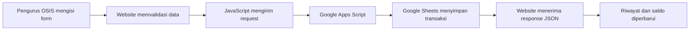

# Budget Tracker OSIS 2026/2027


Website pencatatan keuangan OSIS untuk periode 2026/2027. **Budget Tracker OSIS** digunakan untuk mencatat seluruh pemasukan dan pengeluaran yang dilakukan oleh OSIS, mulai dari awal bulan sampai akhir masa jabatan.

Aplikasi ini membantu pengurus OSIS mencatat transaksi secara lebih rapi, terpusat, dan mudah ditelusuri. Data yang dimasukkan melalui website dikirim ke Google Sheets melalui Google Apps Script sehingga pencatatan dapat dilakukan dari browser tanpa harus mengedit spreadsheet secara manual.

## Tujuan Pembuatan

Project ini dibuat untuk:

- Membantu OSIS mencatat setiap pemasukan dan pengeluaran secara teratur.
- Menjaga riwayat keuangan agar terdokumentasi dari awal bulan hingga akhir masa jabatan.
- Mengurangi risiko catatan hilang, tercecer, atau tertulis ganda.
- Memudahkan pengurus melihat saldo dan riwayat transaksi berdasarkan bulan.
- Mendukung transparansi dan pertanggungjawaban keuangan OSIS.
- Mempercepat proses pencatatan karena data langsung diteruskan ke spreadsheet pusat.

## Cara Pembuatan

<details>
<summary>Klik untuk melihat langkah-langkah pembuatan Budget Tracker OSIS</summary>

### 1. Analisis Kebutuhan

- Menentukan data yang perlu dicatat: bulan, nama transaksi, tanggal, jenis, nominal, penginput, dan keterangan.
- Menentukan fitur utama: tambah, lihat, hitung saldo, dan hapus transaksi.

### 2. Menyiapkan Database

- Membuat Google Sheets sebagai tempat penyimpanan data keuangan OSIS.
- Menentukan kolom tabel agar sesuai dengan data pada formulir website.
- Menyiapkan daftar bulan dan struktur data transaksi.

### 3. Membuat Backend

- Membuat Google Apps Script yang terhubung ke Google Sheets.
- Membuat endpoint untuk mengambil bulan dan riwayat transaksi.
- Membuat proses untuk menambah dan menghapus transaksi.
- Mengatur response backend dalam format JSON.
- Melakukan deployment Google Apps Script sebagai Web App.

### 4. Membuat Frontend

- Membuat struktur halaman menggunakan `index.html`.
- Membuat tampilan responsif menggunakan `style.css`.
- Membuat logika formulir dan tabel menggunakan `script.js`.
- Menambahkan logo OSIS, ringkasan saldo, popup, dan tombol aksi.

### 5. Menghubungkan Frontend dan Backend

- Menyimpan URL backend pada `config.js` lokal.
- Mengirim data transaksi dari website ke Google Apps Script menggunakan `fetch()`.
- Membaca response JSON untuk menampilkan status berhasil atau gagal.
- Memuat ulang riwayat setelah transaksi ditambah atau dihapus.

### 6. Menambahkan Keamanan Konfigurasi

- Memasukkan `config.js` ke `.gitignore` agar URL API tidak ikut diunggah.
- Menyediakan `config.example.js` sebagai contoh konfigurasi.
- Menyimpan URL API pada GitHub Secret `API_URL` untuk proses deployment.

### 7. Pengujian

- Menguji penambahan transaksi pemasukan.
- Menguji penambahan transaksi pengeluaran.
- Memastikan nominal dan saldo dihitung dengan benar.
- Menguji filter riwayat berdasarkan bulan.
- Menguji penghapusan transaksi.
- Memeriksa tampilan pada desktop dan perangkat mobile.

### 8. Deployment

- Mengunggah project ke repository GitHub.
- Mengatur secret `API_URL` pada repository.
- Mengaktifkan GitHub Pages dengan source **GitHub Actions**.
- Menjalankan workflow deployment.
- Memeriksa website setelah berhasil dipublikasikan.

</details>

## Fitur Utama

- Menambahkan catatan pemasukan dan pengeluaran.
- Memilih bulan, tanggal, dan jenis transaksi.
- Mencatat nama transaksi, nominal, penginput, dan keterangan.
- Memformat nominal secara otomatis ke Rupiah.
- Menampilkan riwayat transaksi berdasarkan bulan.
- Menampilkan total pemasukan, total pengeluaran, dan saldo.
- Menghapus transaksi yang tidak diperlukan.
- Menyimpan data secara terpusat melalui Google Sheets.
- Dapat digunakan melalui GitHub Pages.

## Alur Kerja Aplikasi



### Penjelasan Alur

1. Pengurus OSIS membuka website dan mengisi formulir transaksi.
2. Pengurus memilih bulan, tanggal, jenis transaksi, dan mengisi nominal serta keterangan.
3. JavaScript mengubah data formulir menjadi request ke endpoint Google Apps Script.
4. Google Apps Script menerima request dan menulis data ke Google Sheets.
5. Google Sheets menjadi tempat penyimpanan utama seluruh catatan keuangan.
6. Backend mengirim response dalam format JSON ke website.
7. Website menampilkan pesan berhasil dan memperbarui riwayat transaksi serta saldo.

> Secara teknis, website menulis data ke Google Sheets. File spreadsheet tersebut dapat diunduh atau diekspor ke format Microsoft Excel jika diperlukan.

## Struktur File

```text
.
├── index.html                         # Struktur halaman website
├── style.css                          # Tampilan, layout, dan responsive design
├── script.js                          # Logika aplikasi dan komunikasi dengan backend
├── assets/
│   └── logo_OSIS_SMAFISTA.png         # Logo OSIS yang ditampilkan di header dan README
├── config.example.js                  # Template konfigurasi API tanpa URL asli
├── config.js                          # Konfigurasi lokal, tidak diunggah ke Git
├── .gitignore                          # Daftar file yang tidak diunggah ke Git
├── .github/workflows/
│   └── deploy-pages.yml               # Workflow deployment ke GitHub Pages
└── README.md                          # Dokumentasi proyek
```

## Cara Menggunakan

### Menambahkan Transaksi

1. Buka website Budget Tracker OSIS.
2. Pilih bulan transaksi.
3. Masukkan nama transaksi.
4. Pilih tanggal dan jenis transaksi: **Pemasukan** atau **Pengeluaran**.
5. Masukkan nominal transaksi.
6. Isi nama penginput.
7. Tambahkan keterangan jika diperlukan.
8. Klik **Simpan Transaksi**.
9. Setelah berhasil, data akan masuk ke Google Sheets dan muncul pada riwayat transaksi.

### Melihat Riwayat dan Saldo

1. Pilih bulan pada bagian riwayat transaksi.
2. Website akan mengambil data bulan tersebut dari Google Sheets.
3. Periksa daftar transaksi, total pemasukan, total pengeluaran, dan saldo.

### Menghapus Transaksi

1. Temukan transaksi yang ingin dihapus pada tabel riwayat.
2. Klik tombol hapus pada baris transaksi.
3. Periksa kembali transaksi yang dipilih.
4. Klik **Hapus** untuk menghapusnya dari Google Sheets.

## Menjalankan Secara Lokal

1. Clone atau download repository ini.
2. Salin `config.example.js` menjadi `config.js`.
3. Isi `config.js` dengan URL deployment Google Apps Script:

```js
window.APP_CONFIG = {
	API_URL: 'URL_GOOGLE_APPS_SCRIPT_MILIKMU'
};
```

4. Buka `index.html` menggunakan Live Server atau server lokal lainnya.
5. Pastikan browser terhubung ke internet agar website dapat berkomunikasi dengan Google Apps Script.

File `config.js` sengaja dimasukkan ke `.gitignore` karena berisi konfigurasi lokal.

## Konfigurasi Backend

Backend Google Apps Script menyediakan endpoint berikut:

- `GET?action=months` untuk mengambil daftar bulan.
- `GET?action=riwayat&bulan=...` untuk mengambil riwayat transaksi.
- `POST` dengan `action: "tambah"` untuk menyimpan transaksi.
- `POST` dengan `action: "hapus"` untuk menghapus transaksi.

Google Apps Script harus memiliki akses ke Google Sheets yang digunakan sebagai database pencatatan keuangan OSIS. Atur izin deployment sesuai kebutuhan dan pastikan endpoint dapat menerima request dari website.

## Deployment ke GitHub Pages

1. Push seluruh isi project ke repository GitHub.
2. Buka **Settings** > **Secrets and variables** > **Actions**.
3. Buat repository secret dengan konfigurasi berikut:

	 ```text
	 Name: API_URL
	 Secret: URL deployment Google Apps Script
	 ```

4. Buka **Settings** > **Pages**.
5. Pilih **GitHub Actions** sebagai source deployment.
6. Push perubahan ke branch `main` atau jalankan workflow dari tab **Actions**.
7. Tunggu workflow selesai, lalu buka URL GitHub Pages yang diberikan GitHub.

Workflow akan membuat `config.js` secara otomatis saat proses deployment menggunakan secret `API_URL`. Jangan commit `config.js` atau menaruh URL API asli di `config.example.js`.

## Keamanan dan Catatan

- Jangan menyimpan password, token, API key, atau kredensial rahasia di file frontend.
- `config.js` tidak boleh diunggah ke repository public.
- URL API yang dipakai oleh website tetap dapat terlihat oleh pengguna melalui browser karena frontend harus mengakses endpoint tersebut.
- Data keuangan tetap harus dilindungi melalui pengaturan akses Google Sheets dan Google Apps Script.
- Pastikan transaksi diperiksa sebelum disimpan atau dihapus.

## Copyright

&copy; 2026 OSIS SMA Al-Fityan School Tangerang. All rights reserved.

Developed by [Arza Maulana Zafar](https://github.com/Arza707). Designed with AI assistance.
